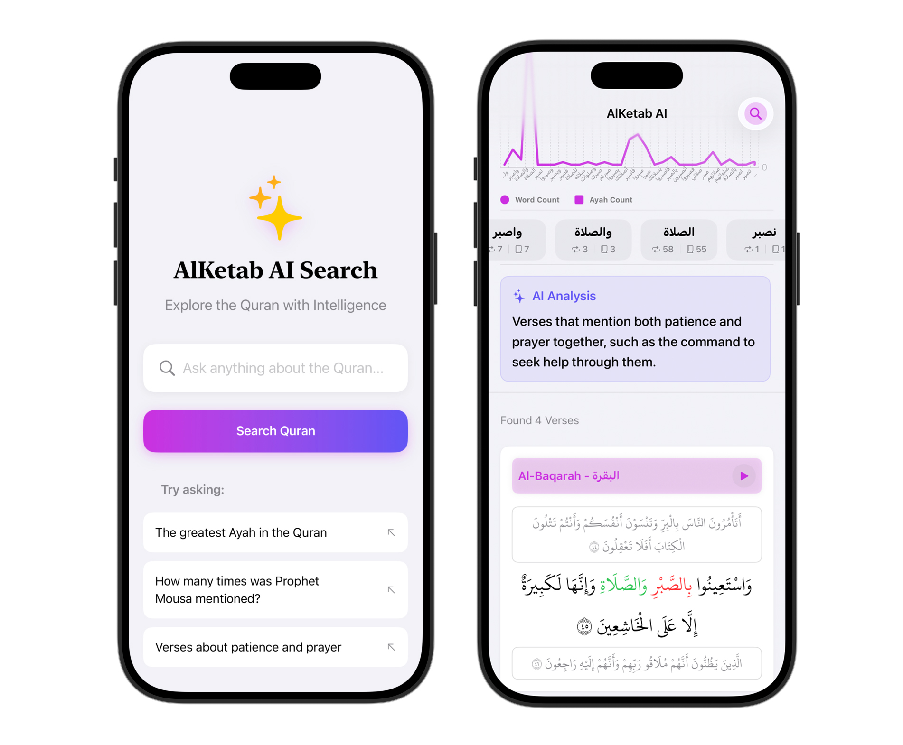

# AlKetab AI Search - iOS Example

This is an open-source example project demonstrating how to integrate the **AlKetab AI Search API** into an iOS application using SwiftUI.



The goal of this project is to show developers how to build a premium, AI-powered Quran search experience using the AlKetab API.

## ✨ Features

*   **AI-Powered Search**: Ask natural language questions to find the most relevant verses.
*   **Contextual Display**: View verses with their surrounding context (Previous and Next Ayahs).
*   **Audio Recitation**: Listen to high-quality audio for each verse directly from the search results.
*   **Beautiful Typography**: Uses authentic Uthmanic font with Arabic numbering.
*   **Dual-Language**: Displays Surah names in both Arabic and English.
*   **Smart Pagination**: Efficiently loads more results as you scroll.


## � Getting Started

To run this project, you need an **API key** from AlKetab.

1.  **Get an API Key**:
    *   Go to [https://alketab-api.web.app](https://alketab-api.web.app)
    *   Sign up for free to get **5,000 credits**.
    *   Copy your key from the dashboard.

2.  **Configure the App**:
    *   Clone this repository and open `AlKetab AI Search.xcodeproj`.
    *   Open the file `Services/AlKetabSearchService.swift`.
    *   Find the line with `#warning`.
    *   **Replace** `ak_xxx` with your actual key:
        ```swift
        private let apiKey = "YOUR_ACTUAL_KEY_HERE"
        ```

3.  **Run**:
    *   Press **Cmd+R** or click the Play button in Xcode.

---

## 📚 API Documentation

Integrate AI-powered Quran search into your applications.

### Base URL
`https://alketab-api.web.app/api/search`

### Authentication
Include your API key in the request header:
`X-API-Key: YOUR_API_KEY`

*   **Ask the AI (Step 1):** Costs 50 credits per call.
*   **Get More Pages (Step 2):** Costs 1 credit per call.

### How It Works

#### 🔍 Step 1: Ask the AI
Send your natural language question using the `message` parameter.

**Example:** "The greatest Ayah in Quran"

The AI returns:
*   `generated_query`: A token to use for pagination.
*   `sort_by`: The recommended sorting order.
*   `verses`: The first page of results.

#### 📄 Step 2: Get More Pages (Pagination)
If the response indicates more pages (`nb_pages > 1`), fetch them using the `generated_query` from Step 1.

**Note:** This skips the AI processing, making it faster and cheaper (1 credit).

### Parameters

| Parameter | Type | Required | Description |
| :--- | :--- | :--- | :--- |
| `message` | string | Yes (Step 1) | Your natural language question. |
| `generated_query` | string | Yes (Step 2) | Value from Step 1 response. Required for pagination. |
| `page` | number | No | Page number (2, 3...). Default is 1. |
| `sort_by` | string | No | Override sort choice. Default is `mushaf`. |

### Sort Options

| Value | Description |
| :--- | :--- |
| `mushaf` | Traditional Quran order (1 → 114). **Default** |
| `score` | Relevance ranking. Best for complex queries. |
| `tanzil` | Revelation order (chronological). |
| `subject` | Topic-based grouping. |

### Example Request

```bash
curl "https://alketab-api.web.app/api/search?message=The%20greatest%20Ayah%20in%20Quran" \
  -H "X-API-Key: YOUR_API_KEY"
```

### Error Handling

| Status | Meaning |
| :--- | :--- |
| **200** | Success |
| **400** | Bad Request - Missing parameters |
| **401** | Unauthorized - Invalid API key |
| **402** | Payment Required - Insufficient credits |

> **Note:** Abuse of the API may result in your key being revoked. Please use responsibly.
